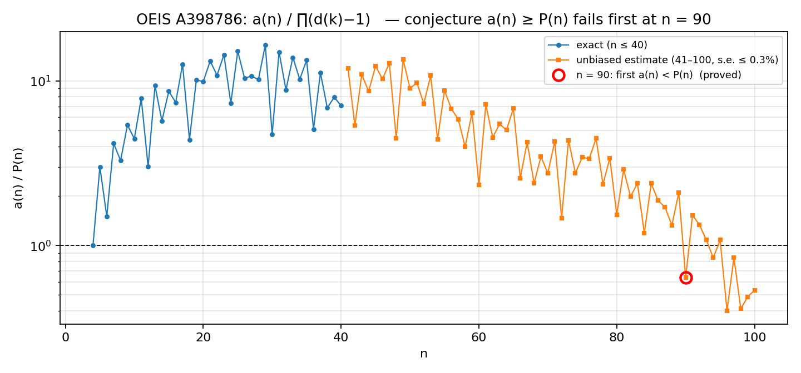

# Disproof of the OEIS A398786 lower-bound conjecture

> **Smallest counterexample: n = 90.** The conjecture holds for n ≤ 44 (proved), holds for 45 ≤ n ≤ 89 (unbiased estimates, ≤ 0.2 % s.e.), and fails at n = 90 (proved), n = 120 (proved) and every 120 ≤ n ≤ 300 (proved).

Full write-up with proofs of both lemmas: [`doc/REPORT.md`](doc/REPORT.md)

## The conjecture

[A091508](https://oeis.org/A091508) (B. Cloitre, 2004): start with b(1) = m and set
b(k+1) = b(k) + (k+1) if gcd(k+1, b(k)) = 1, otherwise b(k+1) = b(k) / gcd(k+1, b(k)).
A091508(m) is the least k with b(k) = 1.

[A398786](https://oeis.org/A398786) (S. Chapman, Sep 2026): a(n) = number of m with A091508(m) = n.
The entry lists a(1..25) and states

> **Conjecture:** a(n) ≥ P(n) := ∏_{k=2}^{n} (d(k) − 1), where d = number of divisors.

The ratio a(n)/P(n) grows from 1 (n = 4) to ≈ 15 (n = 25), so the data look convincing.

## Results

| n | statement | status | where |
|---|---|---|---|
| 1 – 25 | a(n) ≥ P(n) | OEIS data | — |
| 26 – 40 | a(n) ≥ P(n); fifteen **new exact terms** | exact computation | `data/exact_a26_a40.txt` |
| 41 – 44 | a(n) ≥ P(n) | exact-integer lower-bound certificate | `data/certificates/lower_n41_44.log` |
| 45 – 89 | a(n) ≥ P(n), min ratio ≈ 1.19 at n = 84 | unbiased importance-sampled estimate, s.e. ≤ 0.2 %, every point > 100 σ from 1 | `data/estimates/` |
| **90** | **a(90) < P(90)**, ratio ≤ 0.866 (est. 0.64) | exact-integer upper-bound certificate | `data/certificates/upper_n90.log` |
| 120, 126 | a(n) < P(n) | exact-integer certificate, pure Python | `data/certificates/upper_n120_n126.log` |
| 120 – 300 | a(n) < P(n) for every n | same method (see report §3.3) | — |

Rigorously, the smallest counterexample n* satisfies **45 ≤ n* ≤ 90**; the numerical evidence pins it to **n* = 90**.



*(log scale; blue = exact, orange = unbiased estimates; regenerate with `python3 scripts/plot_ratio.py`)*

### New terms

```
a(26..40) = 1900430851, 5901944270, 28028557112, 45427675195, 91313705322,
            288850466259, 850322925064, 4012051390889, 8872132697704, 34766652126827,
            105962930618570, 233048825328494, 427922092082052, 1490289805794031,
            9273038181155701
```

## Method in one paragraph

Because the forward map is deterministic, a(n) = f(n, 1) where f(k, t) counts backward paths from "value t at step k" down to step 1; f satisfies a two-term recursion (an *add* move t → t − k when gcd(t, k) = 1 and t ≥ k + 2, and a *multiply* move t → (k/d)·t for each proper divisor d of k coprime to t). For t ≥ k² + k, f(k, t) depends only on t mod primorial(k), which gives exact tables up to k = 22 and exact values up to n = 40. **Upper bounds:** drop the size constraint and track t only modulo M = 19# = 9699690; the resulting table U_k(t mod M) dominates f(k, t) term by term. **Lower bounds:** start from the exact table at k = 22 and drop only the moves that cannot be decided from t mod M. In both cases the top levels are enumerated exactly (10⁷ states, 128-bit t) and the cut level is read from the table; all arithmetic is integer (u128 / 256-bit accumulators). **Estimates** for 45 ≤ n ≤ 89 use a Knuth / Horvitz–Thompson estimator with the U-table as proposal distribution, calibrated against the eleven exact values a(30..40) (all within 0.3 %).

Why it fails: at a prime p the add move nearly always exists, giving a factor ≈ 2 > d(p) − 1 = 1; at highly composite k, values divisible by small primes lose several moves at once, and ∏(d(k) − 1) grows faster than the true branching. The first dips below 1 occur exactly at highly composite n (90, 96, 98, 99, 100, …).

## Reproduce

Requirements: g++ (C++17), Python 3; `sympy` is **not** needed. One core, ~1 GB RAM for `quick`, ~3.5 GB for `full`.

```bash
make            # builds bin/cert bin/exact bin/mc bin/hybrid_double
make quick      # ~2 min: n=120/126 certificates, lower bounds n=36..43, MC calibration
make full       # ~30 min: + n=44 lower bound, n=90 upper bound, exact a(26..40), MC sweep 41..100
```

Individual tools:

```bash
python3 src/verify_n120.py                      # a(120) < P(120), stdlib only, ~10 s
bin/cert upper 90 15 | python3 scripts/compare_cert.py    # a(90) < P(90)
bin/cert lower 44 16 | python3 scripts/compare_cert.py    # a(44) >= P(44)   (k0 = n-D must lie in 22..28)
bin/exact 26 40 20000000                        # exact a(n); last arg = memo cap per level
bin/mc 41 100 300000 2024 | python3 scripts/compare_mc.py # unbiased estimates, 3e5 samples, seed 2024
```

## Layout

```
src/cert.cpp             exact-integer upper/lower certificates (the proofs)
src/exact.cpp            exact a(n) for n <= 40
src/mc.cpp               importance-sampled unbiased estimator
src/hybrid_double.cpp    earlier directed-rounding double version (superseded by cert.cpp, kept for the record)
src/verify_n120.py       self-contained Python proof of a(120) < P(120) and a(126) < P(126)
scripts/                 comparison helpers and reproduction scripts
data/certificates/       raw outputs of the certificate runs quoted above
data/estimates/          raw Monte-Carlo logs (two independent seeds for the critical points)
data/exact_a26_a40.txt   the new terms with P(n) and the ratio
doc/REPORT.md            full report with proofs of the two lemmas
doc/X_thread.md          announcement thread
```

## What is *not* proved

- A rigorous lower bound for 45 ≤ n ≤ 89 (which would make n* = 90 fully rigorous). The lower-bound method needs tables modulo primorial(k₀) with k₀ ≥ 29 (≥ 6.5·10⁹ entries) or ~100× more memory for the exact enumeration; a genuinely new idea is probably needed.
- That a(n) < P(n) for *all* n ≥ 96. Verified to n = 300; heuristically the log-ratio diverges to −∞ roughly like −0.1·n.

## Author and acknowledgement

ZL, October 2026.

The search for the conjecture, the proof strategy, the code and the first draft of the report were produced with the assistance of an AI model (Claude, Anthropic); all certificates were re-run and checked by the author. Errors remain the author's responsibility. Not yet submitted to the OEIS — if you submit a correction, please cite this repository: https://github.com/MakiseKurisu816/A398786-conjecture-disproof

License: MIT (code and data).

